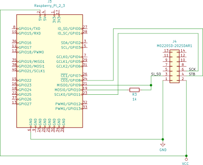

# Time Machine

This repo contains code for **Time Machine**. It is intended as a glue for a kids summer game. The central idea of the game is time travel. So kids will be going through different eras of history of mankind (and beyond). They will collect "time codes" by solving puzzles and other participating in other games. When they punch in the correct time code, time machine will activate and transfer them to the particular era. Transfer is done via playing a video, which introduces them into that era (e.g. info about customs, arts, typical design etc.). 

It has been designed and tested on Raspberry Pi3 running Raspbian.

## Getting Raspberry Pi ready

Let's start with couple dependencies:
```bash
sudo apt install omxplayer python3-spidev python3-yaml
```

As it is expected to be run as automatically as possible, we leverage autologin to console. Which can be also enabled via `raspi-config`. Go to `3 Boot Options`, then `B1 Desktop / CLI` and then `B2 Console Autologin`. In your `.profile` you can then call wrapper:

```bash
/home/pi/timemachine/wrapper.sh
```

## Electonics

### Power supply

ATX power supply from old computer is an ideal solution (`SB` stands for standby). Check [wikipedia](https://en.wikipedia.org/wiki/ATX) for the actual pinouts. But interesting ones are

- pin 3 (and others) - `COM` (`GND`)
- pin 4 - `+5V`
- pin 16 - `PS_ON#`
- pin 9 - `+5VSB`

Pin `+5VSB` provides +5V as long as is the PSU connected to power outlet. It should not be loaded with more then 2A, but that is still plenty for powering up Raspberry PI. Shorting `PS_ON#` to `COM` will turn the PSU on (some really old ones needed load on +5V rail, but that is not typically needed).

Controlling PSU is then achieved with trivial circuit shown below. You can use basically anything you find in your drawer. Current flowing through the control PIN is about 0.4mA on my PSU. Pin marked `CONTROL` on the schematics is connected to `GPIO17` (physical pin 11) on the RPi.


### Vacuum Florescent Display (VFD)

I love these things. I have used [M0220SD‐202SDAR1](https://www.newhavendisplay.com/m0220sd202sdar1-p-812.html) from Newhaven Display for this project. It has 2 lines, every with 20 characters. Fetch a copy of [product specification](http://www.newhavendisplay.com/specs/M0220SD-202SDAR1.pdf) for yourself as you will need to desolder jumper `J4` and short `J3` and `J5` to convert display from parallel Motorola to serial interface. 



Resistor value is again quite arbitrary. We are interfacing 4-wire SPI device (RPi3) with 3-wire SPI device (display). `SL/SO` on the display is bi-drectional, while directions are separated on the RPi3 side (`MOSI` is output, `MISO` is input). Resistor servers as a current protection/limiter in case of error state, where the RPi and display would be both outputting to the same pin with different values.